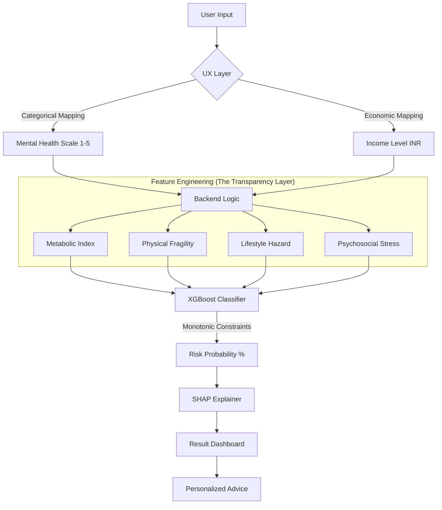

# Diabetes Risk Analysis App (Explainable AI) 🚀

**Live Site**: [diabetes-risk-app.onrender.com](https://diabetes-risk-app.onrender.com)

A full-stack medical AI application that predicts diabetes risk using XGBoost and provides deep insights using **Explainable AI (XAI)**. This project focuses on "Holistic Health" by analyzing metabolic, lifestyle, and psychosocial factors.

## 📊 System Architecture & Flow
The system uses a unique "Transparency Layer" to bridge raw AI data with clinical logic.



## 🌟 Key Features

*   **Holistic Health Indices**:
    *   **Metabolic Index**: Captures synergy between BP, Cholesterol, and BMI.
    *   **Physical Fragility**: Models vulnerability based on age and physical history.
    *   **Lifestyle Hazard**: A punitive scoring system for smoking, alcohol, and inactivity.
    *   **Psychosocial Stress**: First-of-its-kind index combining mental health with economic stability.
*   **Explainable AI (XAI)**:
    *   **Gauge Visualization**: Instant percentage-based risk level.
    *   **Transparency Cards**: Personal breakdown of scores for each health index.
*   **Clinical Safety**: Uses **Monotonic Constraints** to ensure medical common sense (e.g., healthy habits *never* increase risk).

## 📈 Performance Results

The model was trained on **250,000+ records** from the CDC's BRFSS dataset.

| Metric | Score | Importance |
| :--- | :--- | :--- |
| **Recall (Sensitivity)** | **92.3%** | Prioritizes safety by catching 92% of cases. |
| **ROC-AUC** | **0.824** | High reliability in distinguishing risk levels. |
| **Threshold** | **0.27** | Custom-tuned for clinical prevention. |

## 🛠️ Tech Stack

*   **Frontend**: HTML5, Vanilla CSS (Glassmorphism), Chart.js
*   **Backend**: Python, Flask, Gunicorn
*   **Intelligence**: XGBoost, SHAP (Explainable AI)
*   **Data Source**: CDC BRFSS (Behavioral Risk Factor Surveillance System)

## 📝 Local Development

1. Install requirements:
   ```bash
   pip install -r requirements.txt
   ```
2. Run the server:
   ```bash
   python app.py
   ```

---
*Created with ❤️ for health awareness and AI transparency.*
